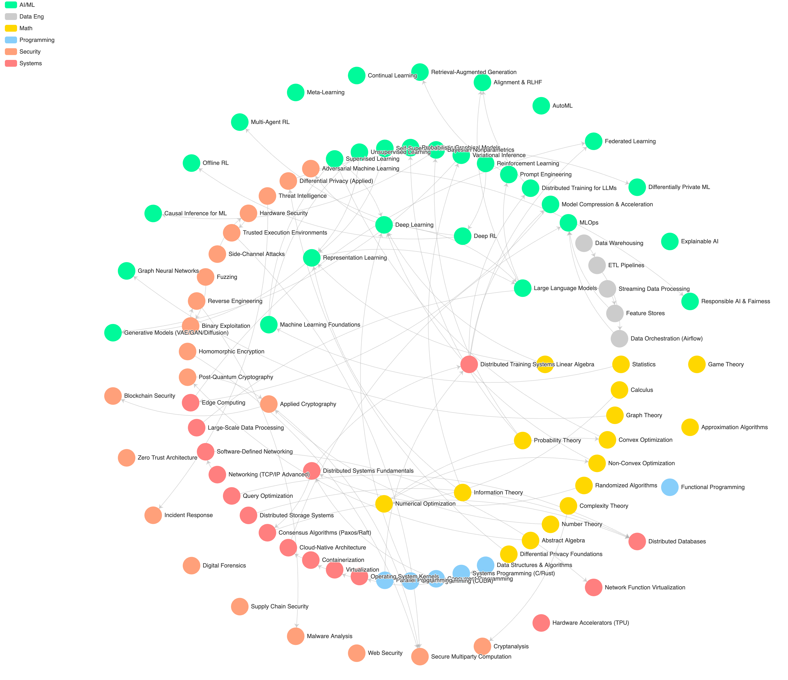

# zhichun_learning_map
 
## Changelog

- Change to pyviz library, Apr. 23rd

## 进度与Todos

- [x] 模版已创建完毕
- [ ] 添加机器学习知识结点
- [ ] 添加计算机知识结点
- [ ] 添加数学知识结点（包括新类别）
- [ ] 添加物理知识结点（包括新类别）

## How to use

<!--  -->

1. 代码模版进行了更新，本地创建环境，需要先运行下面的命令安装python环境。Python环境将用于将json文件转换成HTML代码用于展示。`pip insatll -r requirement.txt`
2. 之后通过修改classes.json文件对数据进行更新。更新后运行main.py更新html文件以便查看更新后的效果。`python main.py`
3. 使用git commit并将修改统一push到github的代码库中

## 数据结构

每个节点是一个知识点（通常对应一门一学期时长的课程的知识体系），对应的颜色是他们所属的学科大类类型，有向边代表该门课的前置知识（prerequisites）。

